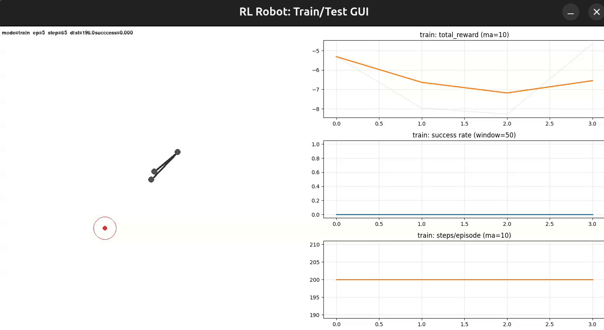
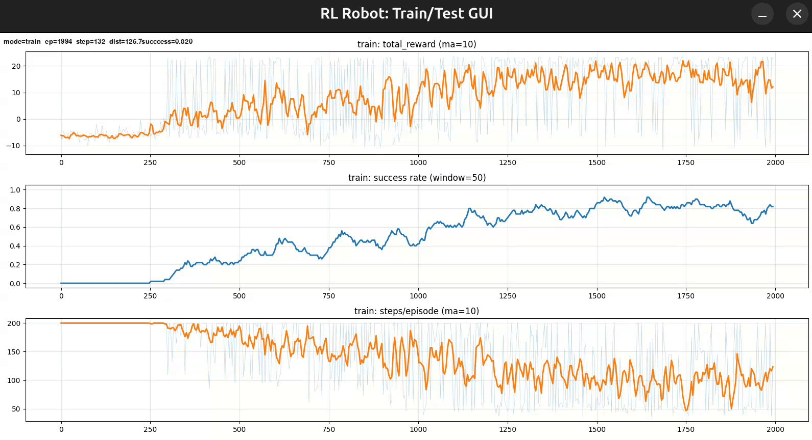

# REINFORCE — 2-DOF Planar Manipulator

Training a two-link planar robot arm to reach arbitrary target points using the REINFORCE policy-gradient algorithm with a moving-average baseline.


---

## Problem Definition

A **two-link (2-DOF) planar manipulator** is mounted on a fixed base.
The agent controls two joint velocities $\Delta\theta_1, \Delta\theta_2$ to move the end-effector toward a randomly placed target point within the reachable workspace.

| Property | Value |
|---|---|
| Link lengths | $L_1 = 100,\; L_2 = 80$ (px) |
| Action constraint | $\|\Delta\theta_i\| \le 0.1$ rad per step |
| Goal condition | End-effector within 30 px of target |
| Max episode length | 200 steps |

The environment is **deterministic**: given the same state and action, the next state is uniquely determined by forward kinematics. Randomness enters only through the initial joint angles and target position, both sampled uniformly at the start of each episode.

---

## Environment

### State Space

An 8-dimensional real-valued vector:

$$s_t = \bigl(\sin\theta_1, \cos\theta_1, \sin\theta_2, \cos\theta_2, x_{ee}, y_{ee}, \Delta x, \Delta y\bigr)$$

| Feature | Description |
|---|---|
| $\sin\theta_i, \cos\theta_i$ | Trigonometric encoding of joint angles avoids the $-\pi/\pi$ discontinuity that raw angles introduce |
| $x_{ee}$ $y_{ee}$ | End-effector position centered on the base and normalized by the maximum reach |
| $\Delta x, \Delta y$ | Signed distance from end-effector to target, normalized by a scale factor (300) |

### Action Space

Continuous, 2-dimensional: $a_t = (\Delta\theta_1, \Delta\theta_2) \in [-0.1, 0.1]^2$ rad.

The policy outputs a mean (bounded via $\tanh$) and a per-joint standard deviation; an action is sampled from the resulting diagonal Gaussian and then hard-clipped by the robot to enforce the physical constraint.

### Termination Conditions

| Condition | Type | Reward signal |
|---|---|---|
| End-effector within `target_thresh` of target | **Success** | $+15$ |
| A link segment passes through the target point | **Failure** | $-5$ |
| Step count reaches `max_steps` | **Truncation** | $-5$ |

### Reward Function

$$r_t = \underbrace{\alpha \cdot (d_{t-1} - d_t)}_{\text{progress}} - \underbrace{\beta}_{\text{step penalty}} + \underbrace{R_{\text{terminal}}}_{\text{goal / fail / timeout}}$$

| Component | Parameter | Default |
|---|---|---|
| Progress scale | $\alpha$ | 0.03 |
| Step penalty | $\beta$ | 0.01 |
| Goal bonus | $R_{\text{goal}}$ | +15.0 |
| Failure / timeout penalty | $R_{\text{fail}}$ | −5.0 |

Optional smoothness penalties ($\|a_t\|^2$ and $\|a_t - a_{t-1}\|^2$) are available but disabled by default.

---

## REINFORCE Algorithm

We use the **REINFORCE** (Monte-Carlo policy gradient) algorithm. The core idea: collect a full trajectory under the current policy, compute returns, and update the policy parameters in the direction that increases the probability of actions that led to higher-than-expected returns.

### Policy Gradient Theorem

The objective is to maximize the expected return:

$$J(\theta) = \mathbb{E}_{\tau \sim \pi_\theta} \left[ \sum_{t=0}^{T} \gamma^t\ \cdot r_t \right]$$

The gradient of this objective is:

$$\nabla_\theta J(\theta) = \mathbb{E}_{\tau \sim \pi_\theta} \left[ \sum_{t=0}^{T} \nabla_\theta \log \pi_\theta(A_t \mid S_t) \cdot G_t \right]$$

where $G_t = \sum_{k=t}^{T} \gamma^{k-t} r_k$ is the discounted return from step $t$.

### Baseline

To reduce variance of the gradient estimate without introducing bias, we subtract a **baseline** $b$ from the returns:

$$\nabla_\theta J(\theta) = \mathbb{E}_{\tau \sim \pi_\theta} \left[ \sum_{t=0}^{T} \nabla_\theta \log \pi_\theta(A_t \mid S_t) \cdot (G_t-b) \right]$$

We use a **moving-average baseline**: $b = \text{mean}(G_0\text{ of last } N \text{ episodes})$, where $N = 200$.

A common but problematic alternative is to normalize advantages within the current episode as $(G_t - \bar{G}) / \sigma_G$. While this centers the returns, dividing by per-episode standard deviation effectively rescales the learning rate on every update, which can destabilize training. Our rolling buffer approach avoids this by providing a stable, slowly-adapting baseline.

### Gaussian Policy

The policy network outputs parameters of a diagonal Gaussian distribution:

$$\mu = \tanh(\text{head}_\mu(z)) \cdot \Delta\theta_{\max}$$

$$\sigma = \exp\bigl(\text{clamp}(\text{head}_\sigma(z),\ \log\sigma_{\min},\ \log\sigma_{\max})\bigr) \cdot \Delta\theta_{\max}$$

where $z$ is the output of a shared MLP trunk. The $\tanh$ on the mean ensures it stays within the physical action bounds. Standard deviation is clamped in log-space to $[-3.0, -0.5]$ to prevent collapse or explosion.

### Update Rule

After each episode:

1. Compute discounted returns $G_t$ for every step.
2. Compute advantages: $G_t - b$.
3. Compute the loss:
$$\mathcal{L} = -\frac{1}{T} \sum_{t=0}^{T} \log \pi_\theta(a_t \mid s_t) \cdot (G_t - b)$$
4. Backpropagate and update $\theta$ with Adam (gradient norm clipped to 1.0).
5. Step the cosine-annealing learning rate scheduler.
6. Append $G_0$ to the baseline buffer.

---

## Development History

### Iteration 1 — Feasibility Check

We started with a simple program to verify that the task is solvable at all: a fixed start position, a fixed target, and a **discrete** action space. The agent learned to reach the target reliably, confirming that the problem is well-posed and the reward signal is informative enough for learning.


### Iteration 2 — Continuous Actions, Static Target

We moved to a continuous Gaussian action space while keeping the target fixed (one target position) and randomizing only the robot's initial joint angles at each episode. Configuration:

- **Continuous action space**: Gaussian policy over $(\Delta\theta_1, \Delta\theta_2)$ bounded by $\pm0.1$ rad
- **Network**: 2 hidden layers, 128 units each
- **State**: full observation including joint encodings and end-effector position
- **Hyperparameters**: $\text{lr} = 10^{-4}$ (annealed), $\gamma = 0.99$

The agent learned to reach the single (static) target from randomized starts with high reliability (training stabilised in the order of ~1000 episodes).

Training on the static target (no-sim render):


Trained policy evaluation on the static target:


### Iteration 3 — Continuous Actions, Random Targets

We moved to the full problem: **random initial joint angles**, **random target positions** within the reachable workspace, and a **continuous Gaussian action space**. Key changes:

- State extended to 8 dimensions (added normalized EE position)
- Policy outputs 4 parameters: 2 means + 2 log-stds (two-headed network)
- Mean bounded via $\tanh$ to respect the ±0.1 rad constraint; sampled actions beyond bounds are clipped
- Learning rate annealed from $10^{-4}$ to $10^{-5}$ via cosine schedule
- Moving-average baseline buffer (200 episodes) instead of per-episode normalization
- $\gamma = 0.99$

Early training — the agent starts exploring and learning to reach targets (rendering each 10-th robot step):



Full training run (5000 episodes, simulation hidden for speed):



Extended metrics view (all 7 training metrics):


Trained policy evaluation on random targets (sped-up):


---

## Project Structure

```
├── main.py                  # Entry point: argparse, config assembly, GUI launch
├── requirements.txt
├── README.md
├── LICENSE
├── assets/                  # Demo GIFs and source videos
├── policy/
│   └── best_policy.pt       # Saved trained policy weights
└── reinforce/
    ├── __init__.py
    ├── config.py            # Dataclass configs (Robot, Model, Reward, Env, GUI)
    ├── state.py             # State dataclass (8-dim observation vector)
    ├── robot.py             # 2-DOF planar arm: forward kinematics, step, obs
    ├── env.py               # RL environment: reset, step, reward, termination
    ├── model.py             # GaussianMLPPolicy + REINFORCE Model (train/test)
    └── gui.py               # Pygame GUI with live matplotlib plots
```

---

## Hyperparameters

| Parameter | Value |
|---|---|
| Hidden layers | 2 × 128 (ReLU) |
| Discount $\gamma$ | 0.99 |
| Learning rate | $10^{-4}$ → $10^{-5}$ (cosine annealing) |
| Baseline buffer | 200 episodes |
| Gradient clip norm | 1.0 |
| $\log\sigma$ range | $[-3.0, -0.5]$ |
| Max episode steps | 200 |
| Training episodes | 5000 |
| Test episodes | 200 |

---

## Reproducibility (implemented using python3.12)

### Install

```bash
pip install -r requirements.txt
```

### Train

```bash
python main.py --train
```

Training runs for 5000 episodes (configurable via `--train-episodes N`). After training completes, the model is saved and test evaluation begins automatically. A Pygame window shows the robot simulation on the left and live training plots on the right.

For faster training without the simulation panel:

```bash
python main.py --train --no-sim
```

### Test

```bash
python main.py --test
```

Loads the saved policy and runs 200 test episodes (configurable via `--test-episodes N`) with the simulation visible.

### Additional Options

```
--model-path PATH      Path to .pt model file (default: policy/best_policy.pt)
--train-episodes N     Number of training episodes
--test-episodes N      Number of test episodes
--seed N               Random seed (default: 42)
--extended             (with --train --no-sim) Show all 7 training metrics
```

### Output

- **Live GUI**: robot arm visualization + real-time plots (reward, success rate, steps per episode)
- **Saved model**: `policy/best_policy.pt`
- **Metrics displayed**: total reward (moving avg), success rate (sliding window), steps/episode

---

## Collected Metrics

| Metric | Description |
|---|---|
| Total reward | Sum of rewards for the episode |
| Success rate | Sliding-window average of goal-reached episodes |
| Steps / episode | Number of steps taken before termination |
| Final distance | End-effector to target distance at episode end |
| Policy loss | REINFORCE loss value |
| Baseline | Current moving-average baseline value |
| Gradient norm | Norm of the policy gradient (post-clip) |
